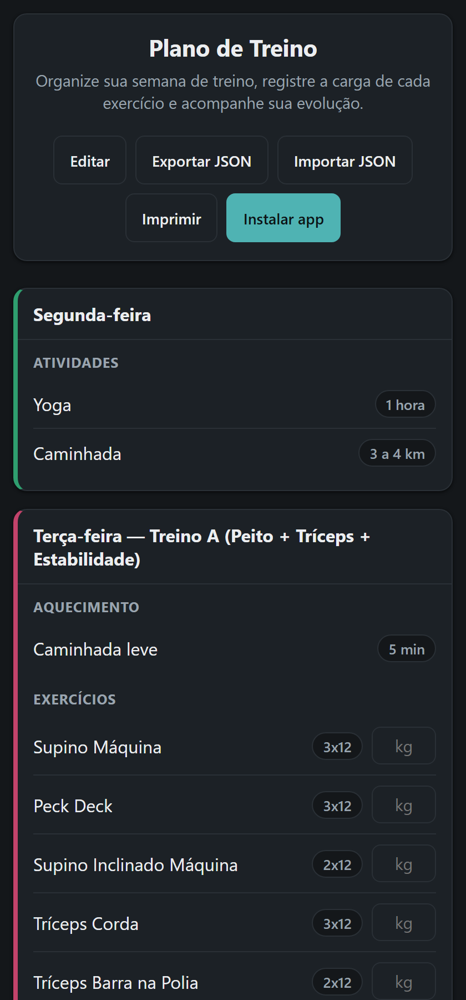

# Plano de Treino

App de treino instalável (PWA) — organize sua semana de treino, com exercícios, séries e repetições. **Status: beta (v0.1.0-beta).**

🔗 **App:** https://cabralporto.github.io/treino-app/



## Recursos

- Plano de treino semanal editável (dias, seções, exercícios).
- Exportar/Importar o plano em JSON (serve como backup e para levar seus dados para outro aparelho).
- Instalável na tela inicial do celular, funciona offline depois de instalado.
- Modo claro/escuro automático.

## Privacidade e segurança

- **Sem servidor, sem conta, sem coleta de dados.** Tudo o que você registra fica só no `localStorage` do seu navegador/aparelho — veja [privacidade.html](privacidade.html).
- **Zero dependências de terceiros em produção** — nenhum pacote npm é carregado no navegador, o que elimina risco de supply-chain nesse ponto.
- Content Security Policy restritiva (`default-src 'self'`), já que o app não depende de nenhum recurso externo.
- Validação de tamanho/formato em qualquer JSON importado.

> **Limitação conhecida:** o GitHub Pages não permite configurar headers HTTP customizados, então proteções como `Strict-Transport-Security` só existem via meta tag quando o navegador suporta (a maioria não suporta fora de HTTP). Se isso vier a ser um requisito, a alternativa é migrar a hospedagem estática para um serviço como Cloudflare Pages ou Netlify.

## Rodando localmente

Não há build step — é só HTML/CSS/JS puro servido como arquivos estáticos:

```bash
python -m http.server 8765
# abra http://localhost:8765/index.html
```

## Testes

```bash
node --test
```

## Instalar no celular

1. Abra https://cabralporto.github.io/treino-app/ no Chrome do celular.
2. Toque no menu (⋮) → **Instalar app** / **Adicionar à tela inicial** (ou use o botão "Instalar app" que aparece dentro do próprio app quando disponível).

## Licença

Veja [LICENSE](LICENSE) — todos os direitos reservados. Projeto em fase beta, ainda sem modelo de comercialização definido.
